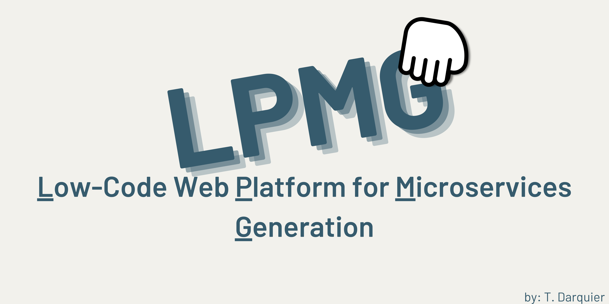
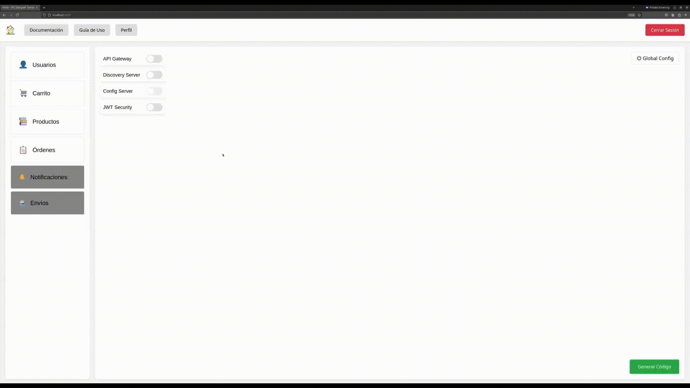
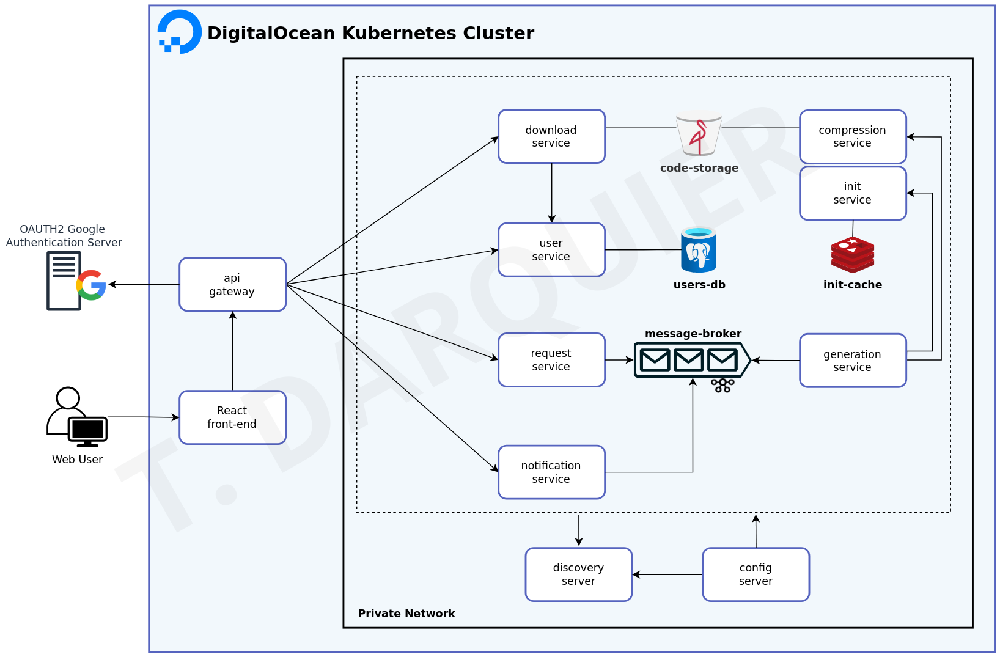

<p align="center">
    
</p>

# LPMG: Low-code Platform for Microservices Generation 🚀

LPMG is a platform designed to create a **preconfigured foundation of services** upon which you can build your application with ease and speed.

🤔 **Why LPMG?**  
When working on small microservices projects, we often waste time creating the same components over and over: users, notifications, configuring clients, setting up Spring Cloud services... With LPMG, you can skip all that repetitive work and focus on what truly matters—your business logic!

---
# Project Overview

⚠️ **Important Notice** ⚠️

This project is a **portfolio demonstration** designed to showcase the integration of various methodologies, such as Kafka with SSL, service-to-service communication via JWT, and user authentication using OAuth2. For simplicity and to facilitate testing, **all credentials are exposed** in the codebase, **except for the Auth0 credentials**, which remain private for security reasons. These credentials are **only for demonstration purposes** and should **not be used in a production environment**.

💡 **Why credentials are exposed**: Since this is not a production application, the focus is on demonstrating the system’s functionality, including how services communicate and how security mechanisms like SSL can be incorporated. These credentials are provided purely for testing and understanding the project’s behavior.

---

## 🌟 How It Works
<p align="center">
    
</p>

It's simple!
1. **Drag and drop** the components you need onto the canvas.
2. Connect them if they depend on each other.
3. Configure their ports, paths, persistence layers, and other attributes.
4. Done! 🎉 Download the project and start building your business logic—everything else is already set up for you!

---

## 🏗️ Architecture Diagram
If you're curious about the architecture, I wrote a blog post detailing it. Spoiler: I don't think it's perfect! 😅

Read it [_here_](https://blog.tomasdarquier.com/como-estructure-la-arquitectura-de-mi-plataforma-web-de-generacion-de-codigo).

<p align="center">
    
</p>

---

## 🛠️ Key Libraries and Tools

<details>
<summary>1. Core Frameworks 🌟</summary>

- **Spring Boot**: The foundation for building fast and robust Java applications.
  - **`spring-boot-starter-web`**: For building REST APIs.
  - **`spring-boot-starter-data-jpa`**: For data access and management with JPA.
  - **`spring-boot-starter-data-rest`**: Exposes JPA data via REST endpoints.
  - **`spring-boot-starter-actuator`**: For monitoring and metrics.

</details>

<details>
<summary>2. Microservices Architecture 🏗️</summary>

- **Spring Cloud**: Tools for managing microservices, such as:
  - **`spring-cloud-starter-netflix-eureka-client`**: Service registry and discovery.
  - **`spring-cloud-starter-openfeign`**: Declarative HTTP clients for service communication.
  - **`spring-cloud-starter-config`**: Centralized configuration management.

</details>

<details>
<summary>3. Authentication and Security 🔒</summary>

- **Okta**: Authentication solution with easy integration.
  - **`okta-spring-boot-starter`**: Native support for Spring.

</details>

<details>
<summary>4. Persistence and Storage 📦</summary>

- **PostgreSQL**: Relational database for structured data.
- **Redis**: In-memory storage for caching and key-value data.
- **MinIO**: Object storage solution for large-scale data.

</details>

<details>
<summary>5. Data Handling 📊</summary>

- **Jackson Databind**: For JSON serialization and deserialization.
- **Apache Velocity**: Dynamic code template generation.
- **Apache Jena**: Working with RDF data and ontologies.

</details>
<!--
<details>
<summary>6. Testing and Agile Development ⚙️</summary>

- **Spring Boot Testing**: Integrated testing for Spring:
  - **`spring-boot-starter-test`**: Core test suite.
  - **`spring-kafka-test`**: Kafka-specific testing tools.
- **Lombok**: Reduces boilerplate code.
- **Spring DevTools**: Speeds up development with fast restarts.

</details>
-->


---

## 🚀 Getting Started 
Before you begin, ensure you meet the following requirements:
- **Linux or macOS**
- **Java 17+**
- **Docker**

### Steps
1. Clone the repository:
   ```shell
   git clone https://github.com/TomasDarquier/LPMG
   ```  
2. Follow the steps to generate Auth0 credentials 🔐:
   - Read the [_official documentation_](https://developer.auth0.com/resources/labs/tools/auth0-cli-basics) to install the Auth0 CLI if you don't have it already.
   - Open a terminal and run the following command to configure the Auth0 CLI and get an API key for your tenant:
       ```shell
       auth0 login
       ```  
   - Then, create the Auth0 app with the following command:
       ```shell
       auth0 apps create \
       --name "LPMG Development Enviroment" \
       --description "Low-Code Web Platform for Microservices Generation" \
       --type regular \
       --callbacks http://localhost:8080/login/oauth2/code/okta \
       --logout-urls http://localhost:8080 \
       --reveal-secrets
       ```  
   - From the repository's main folder, run the following command to create the application.properties file:
       ```shell
      printf "#issuer appears like Domain in auth0 web\nokta.oauth2.issuer=https://<domain>/\nokta.oauth2.client-id=<client-id>\nokta.oauth2.client-secret=<client-secret>\nokta.oauth2.groupsClaim=https://spring-boot.example.com/roles\nokta.oauth2.audience=\${okta.oauth2.issuer}api/v2\n" > config-server/src/main/resources/configurations/application.properties
       ```  
   - Go to www.auth0.com, log in with your credentials, navigate to Applications, open the application you created, and copy the values for Domain, Client ID, and Client Secret. Use these values to fill in the file created in the previous step. The file should look like this:
       ```  shell
      # Invented values, don't try to use them
       okta.oauth2.issuer=https://dev-example123.us.auth0.com/
       okta.oauth2.client-id=abc123xyz456
       okta.oauth2.client-secret=def789ghi012jkl345mno678pqr901stu234
       okta.oauth2.groupsClaim=https://spring-boot.example.com/roles
       okta.oauth2.audience=${okta.auth2.issuer}api/v2/
       ```  
#### Start from Docker

3. Start the system from the root folder:
   ```shell
   docker compose up -d --build
   ```  
4. Go to [localhost:8080](http://localhost:8080) and test the app! (If you experiment any problem, probably you need to wait a few seconds to let the discovery server discover all the services) 

5. To stop the services, stop Docker Compose from root folder:
   ```shell
   docker compose down
   ```

#### Start directly from the code 

3. Start the persistence components:
   ```shell
   cd docker/
   docker compose up -d
   ```  

4. Run the script to start all services in the correct order:
   ```shell
   ./start_services.sh
   ```  
   (If you start the services manually from the console, dont forget to use the 'local' profile in all services, except config-server, do not use any profile there)

5. Go to [localhost:8080](http://localhost:8080) and test the app! (If you experiment any problem, probably you need to wait a few seconds to let the discovery server discover all the services) 

6. To stop the services, run the shutdown script and stop Docker Compose:
   ```shell
   ./kill_services.sh
   docker compose down
   ```

---
