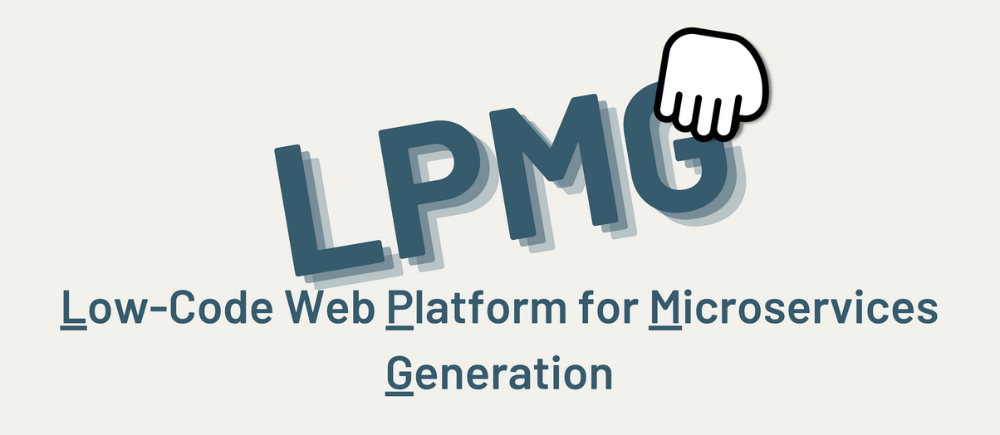

<p align="center">
    
</p>

# LPMG: Low-code Platform for Microservices Generation 🚀

LPMG is a platform designed to create a **preconfigured foundation of services** upon which you can build your application with ease and speed.

🤔 **Why LPMG?**  
When working on small microservices projects, we often waste time creating the same components over and over: users, notifications, configuring clients, setting up Spring Cloud services... With LPMG, you can skip all that repetitive work and focus on what truly matters—your business logic!

---

## 🌟 How It Works
<p align="center">
    
</p>

It's simple!
1. **Drag and drop** the components you need onto the canvas.
2. Connect them if they depend on each other.
3. Configure their ports, paths, persistence layers, and other attributes.
4. Done! 🎉 Download the project and start building your business logic—everything else is already set up for you!

---

## 🏗️ Architecture Diagram
If you're curious about the architecture, I wrote a blog post detailing it. Spoiler: I don't think it's perfect! 😅

Read it [_here_](https://blog.tomasdarquier.com/como-estructure-la-arquitectura-de-mi-plataforma-web-de-generacion-de-codigo).

<p align="center">
    
</p>

---

## 🛠️ Key Libraries and Tools

<details>
<summary>1. Core Frameworks 🌟</summary>

- **Spring Boot**: The foundation for building fast and robust Java applications.
  - **`spring-boot-starter-web`**: For building REST APIs.
  - **`spring-boot-starter-data-jpa`**: For data access and management with JPA.
  - **`spring-boot-starter-data-rest`**: Exposes JPA data via REST endpoints.
  - **`spring-boot-starter-actuator`**: For monitoring and metrics.

</details>

<details>
<summary>2. Microservices Architecture 🏗️</summary>

- **Spring Cloud**: Tools for managing microservices, such as:
  - **`spring-cloud-starter-netflix-eureka-client`**: Service registry and discovery.
  - **`spring-cloud-starter-openfeign`**: Declarative HTTP clients for service communication.
  - **`spring-cloud-starter-config`**: Centralized configuration management.

</details>

<details>
<summary>3. Authentication and Security 🔒</summary>

- **Okta**: Authentication solution with easy integration.
  - **`okta-spring-boot-starter`**: Native support for Spring.

</details>

<details>
<summary>4. Persistence and Storage 📦</summary>

- **PostgreSQL**: Relational database for structured data.
- **Redis**: In-memory storage for caching and key-value data.
- **MinIO**: Object storage solution for large-scale data.

</details>

<details>
<summary>5. Data Handling 📊</summary>

- **Jackson Databind**: For JSON serialization and deserialization.
- **Apache Velocity**: Dynamic code template generation.
- **Apache Jena**: Working with RDF data and ontologies.

</details>
<!--
<details>
<summary>6. Testing and Agile Development ⚙️</summary>

- **Spring Boot Testing**: Integrated testing for Spring:
  - **`spring-boot-starter-test`**: Core test suite.
  - **`spring-kafka-test`**: Kafka-specific testing tools.
- **Lombok**: Reduces boilerplate code.
- **Spring DevTools**: Speeds up development with fast restarts.

</details>
-->


---

## 🚀 Getting Started
Before you begin, ensure you meet the following requirements:
- Linux or macOS
- **Java 17+**
- **Docker**

### Steps
1. Clone the repository:
   ```shell
   git clone https://github.com/TomasDarquier/LPMG
   ```  
2. Check the [_Wiki_]() to generate Auth0 credentials 
3. Start the persistence components:
   ```shell
   cd LPMG/
   docker compose up -d
   ```  
4. Run the script to start all services in the correct order:
   ```shell
   ./start_services.sh
   ```  
5. To stop the services, run the shutdown script and stop Docker Compose:
   ```shell
   ./kill_services.sh
   docker compose down
   ```

---

## 🙌 How to Contribute

We welcome contributions! Here's how you can help:
1. Check the [project board](https://github.com/TomasDarquier/LPMG/projects) for open tasks.
2. Fork the repository and work on an issue.
3. Create a pull request with your changes.

### Guidelines
- Follow the project's coding standards.
- Document your changes clearly.
- Test your contributions thoroughly.

---

💡 **Have ideas or found an issue?** Open an issue on GitHub or reach out! Let's build this platform together! 🌟
